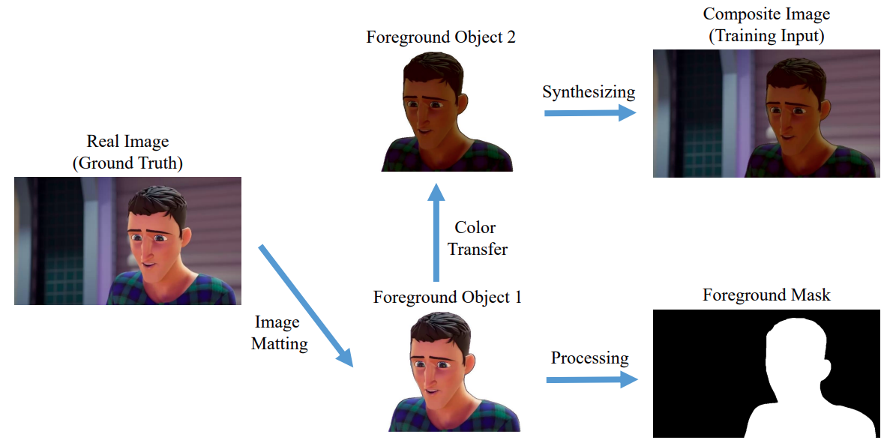
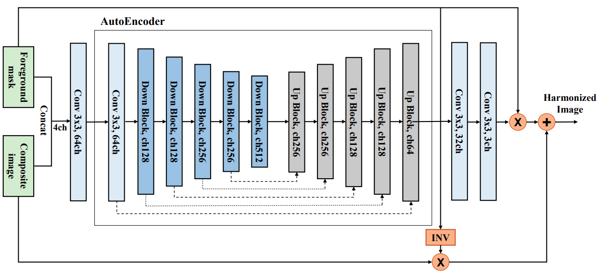
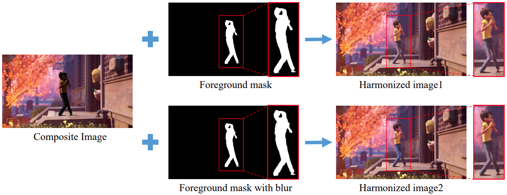
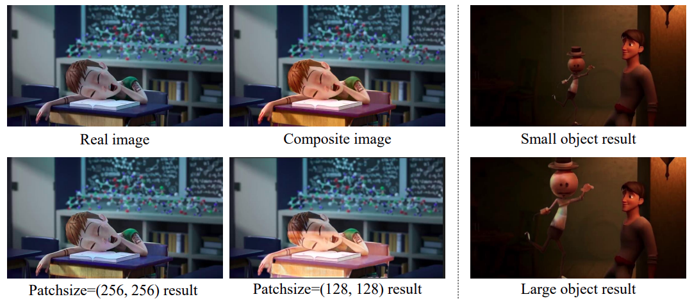
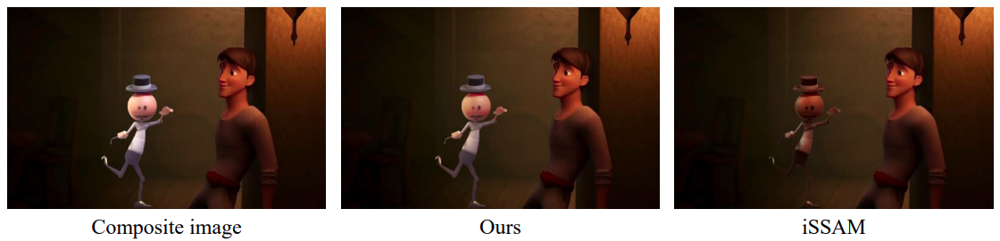

# AnimeDIHNet
- Computational Photography Final Project : Animation Image Harmonization 
- Team Member: Jason Tu and Sharon Tsai
- Date: 2022/05/17-2022/6/17

## Requirements
- pytorch
- opencv
- numpy
- argparse
- imageio
- scikit-image

## Introcdution
Image harmonization is an important step in photo editing. Given the foreground and background images, if we directly composite them without any action, it may look so weird. The task of image harmonization is to make those images visually consistent. In the project, we will aim at animation images to perform image harmonization.

## Dataset
Since our topic is the specific application of image harmonization for animation images, and there is no related dataset supporting our demands, we need to construct animation image dataset by ourselves. You can also directly use [our dataset][1]. The following shows our dataset construction flow:

- Steps
    - Pick the target video to get animation images (`data_preprocessing/video_sub.py`).
    - [Remove the background][2] of ground truth images to get foreground masks, perform color transfer, and composite images (`data_preprocessing/data_preprocessing.py`).
    - (Optional) Blur foreground masks with Gaussian filter (`data_preprocessing/mask_blurring.py`)

## Model
The architecture of our AnimeDIHNet (Animation Deep Image Harmonization Network)


## Usage
### Train
```
python train.py --nEpochs 240      \
                --cuda             \ 
                --thread 0
```
### Test
```
python test.py --model_path model_trained/<model_trained filename>.pth  \
                --nTest 20                                              \
                --cuda
```
Here we provide [three model files][3] that we had trained: `unet_mse.pth`, `unet_mse.pth` and `unet_attention.pth`.

## Experiments
### Foreground mask without/with blur


### Different patch and foreground object size


### Comparison with recent work
|          | fMSE      |    MSE    | PSNR      |    SSIM    |
| -------- | --------- |:---------:| --------- |:----------:|
| **Ours** | **62.17** | **11.83** | **35.83** | **0.9763** |
| iSSAM    | 98.59     |   13.47   | 34.60     |   0.9547   |




### Backup
- You can directly execute `run_train.bat` or `run_test.bat` to train or test the model. Some model arguments are written in the front part of `train.py` and `test.py`.
- There are more details in `document/`, and some reference papers are in `reference/`.

[1]:https://drive.google.com/drive/folders/1BI6-gSlj4X5AVMFletzb1rXpVs_Vo4FT?usp=sharing
[2]:https://github.com/danielgatis/rembg.git
[3]:https://drive.google.com/drive/folders/1LmHU3OSkZrUqMnnonmwF_Y8wC7jW_QMx?usp=sharing